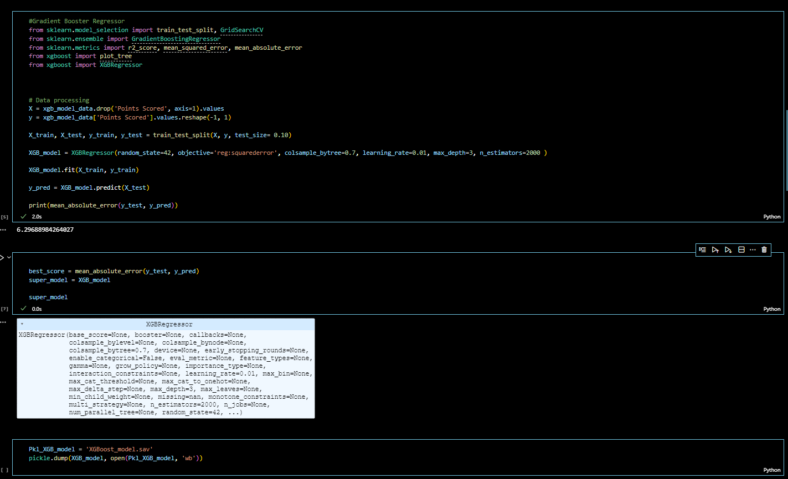

# TouchdownProphet

Grade: 95/100

Welcome to Touchdown Prophecy, your go-to platform for elevating your Super Bowl outcome predictions. Ascertaining the true value of the NFL betting scene poses a considerable challenge, fluctuating between a staggering 700 Billion to 1 Trillion. Additionally, the clandestine market further swells this figure by an estimated 500 Billion. If your objective is financial gain, rely on us to amplify your odds of success.
Thank you for choosing our application. We anticipate achieving victories together. May the Touchdown Prophecy be with you!

**Disclaimer: This content is for informational purposes only and does not constitute betting advice.**

### Contributors

- James Davidson  
- Donya Ahmadi  
- Kobe Buncu  

## Requirements

This project utilizes python 3.10 Streamlit and scikit-learn.

A [conda](https://docs.conda.io/en/latest/) environment with liabraries listed below and [Jupyter Notebook/Lab](https://jupyter.org/) are required to run the code.

The following library was used:

1. [Scikit Learn](https://scikit-learn.org/stable/index.html) - Scikit Learn or Sklearn is one of the most used Python libraries for Data Science, along with others like Numpy and Pandas.

2. [Streamlit](https://streamlit.io/) - Streamlit turns data scripts into shareable web apps in minutes.

Install the following librarie(s) in your terminal...

    pip install -U scikit-learn
    pip install streamlit
 
---

## Data

The CSV files used in our codes were mainly created from https://pro-football-reference.com

---

## Process & Visualizations

The first step in our goal of predicting Super Bowl winners was to collect historical data from NFL teams. We opted to collect 10 years of Offense and Defense team statistics dating back to 2014. The following visualizations illustrate the original dataframes that were read from the csv files, collected from pro football reference. Additionally, we also downloaded data from the past 10 years of Super Bowl winners.    

Offense:

Defense:

Super Bowl:

After collecting all the necessary data, we proceeded to clean the various dataframes and then combined the dataframes by 'Year' and 'Team' until we were left with a single dataframe. Once the final dataframe was generated we proceeded to standardize the 10 years of Team data, via `StandardScaler`, and issue Offensive and Defensive ranks, by way of y-hat predicted values using, both `LogisticRegression` and `AdaBoostClassifier` models. We then saved each model into separate csv files, which will be required in building our machine-learning models.

Completed Dataframe:

LR Prediction Values:

ADA Prediction Values:

## Score Prediction Model Implementation Process

To run our Super Bowl simulation models we would first need to run a simulation of 17 regular season games for all 32 NFL teams to select the 14 teams that would advance to the playoffs. 

As an expirement, as well as for presentation purposes, we decided to use the most recent year of 2023 to run our models. To accomplish this we first imported all 17 game statistics, of all 32 NFL teams, from the 2023 regular season. After which, we combinded all 544 regular-season games into a single dataframe and converted all 'object' and 'NaN' values into 0's and 1's. The final step to generate the finalized dataframe used in the our prediction models, was to add the LR and ADA prediction value's computed in the process above, as visualizaed below.

2023 Season:

### Models

MLP Regressor Model:

Logistic Regression Model:

XG Boost Model:

## Front End Application

Team Selection:

Model Selection:

Run Model Projections:

WINNER:

## User Experience
Go to the Anaconda Prompt to launch JupyterLab by typing Jupyter Lab. To use this application simply clone the repository and run the app.py file in your Jupyter Lab. Open a terminal and input streamlit run app.py
